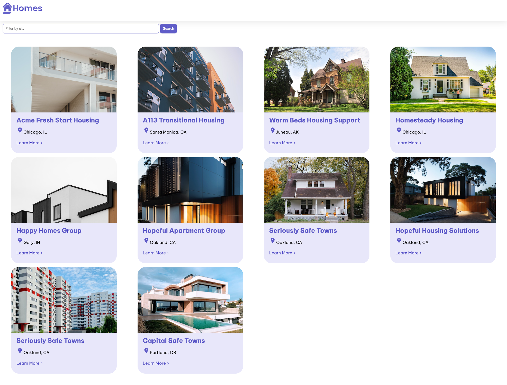

 
   
  <em>Angular es una plataforma de desarrollo para construir aplicaciones web móviles y de escritorio.
      usando TypeScript/JavaScript y otros lenguajes.</em>
   

Crear un eCommerce efectivo en Angular 17 implica tener en cuenta varias técnicas y recomendaciones para garantizar una experiencia de usuario fluida y funcionalidad adecuada. Aquí te proporciono algunas sugerencias:

1. **Arquitectura y Estructura:**
   - Utiliza una estructura modular para organizar tu aplicación Angular, separando componentes, servicios y módulos de forma lógica.
   - Emplea Lazy Loading para cargar módulos de manera diferida y optimizar la carga inicial de la aplicación.
   - Define una arquitectura de componentes reutilizables que puedan ser utilizados en diferentes partes de tu eCommerce.

2. **Diseño Responsivo:**
   - Asegúrate de que tu eCommerce sea completamente responsive, adaptándose a diferentes tamaños de pantalla y dispositivos.
   - Utiliza frameworks CSS como Bootstrap o TailwindCSS para facilitar la creación de diseños responsivos y consistentes.

3. **Rendimiento:**
   - Optimiza el rendimiento de tu aplicación Angular utilizando técnicas como lazy loading, compresión de recursos, y minimización de archivos CSS y JS.
   - Implementa un sistema de caché adecuado para reducir las solicitudes al servidor y mejorar los tiempos de carga de la página.

4. **Seguridad:**
   - Implementa medidas de seguridad como HTTPS, protección contra ataques XSS y CSRF, y validación adecuada de datos tanto en el frontend como en el backend.
   - Utiliza técnicas de encriptación para proteger la información sensible de los usuarios, como contraseñas y datos de pago.

5. **Optimización SEO:**
   - Utiliza Angular Universal para renderizar el contenido en el servidor y mejorar la indexación por parte de los motores de búsqueda.
   - Asegúrate de utilizar URLs amigables y descriptivas, etiquetas meta adecuadas y estructura semántica en tu HTML para mejorar el SEO.

6. **Usabilidad y Experiencia de Usuario:**
   - Diseña una interfaz intuitiva y fácil de usar, con navegación clara y botones de llamada a la acción destacados.
   - Implementa funcionalidades como carrito de compras, búsqueda avanzada, filtros de productos y opciones de pago seguras.
   - Realiza pruebas de usabilidad y recopila comentarios de los usuarios para mejorar continuamente la experiencia de usuario.

7. **Integraciones y Funcionalidades:**
   - Integra pasarelas de pago seguras y confiables que sean compatibles con tu eCommerce.
   - Implementa funciones de seguimiento de pedidos, notificaciones por correo electrónico y chat en línea para mejorar la comunicación con los clientes.
   - Utiliza APIs para integrar funcionalidades como análisis de datos, gestión de inventario y personalización de la experiencia de usuario.

8. **Pruebas y Mantenimiento:**
   - Realiza pruebas exhaustivas tanto a nivel unitario como de integración para garantizar el correcto funcionamiento de tu eCommerce.
   - Establece un plan de mantenimiento regular para aplicar actualizaciones de seguridad, correcciones de errores y mejoras de rendimiento.

Al seguir estas técnicas y recomendaciones, podrás crear un eCommerce efectivo en Angular 17 que ofrezca una experiencia de usuario óptima y cumpla con los estándares de seguridad y rendimiento necesarios para el éxito en línea.

# Vista previa conceptual de tu primera aplicación Angular

